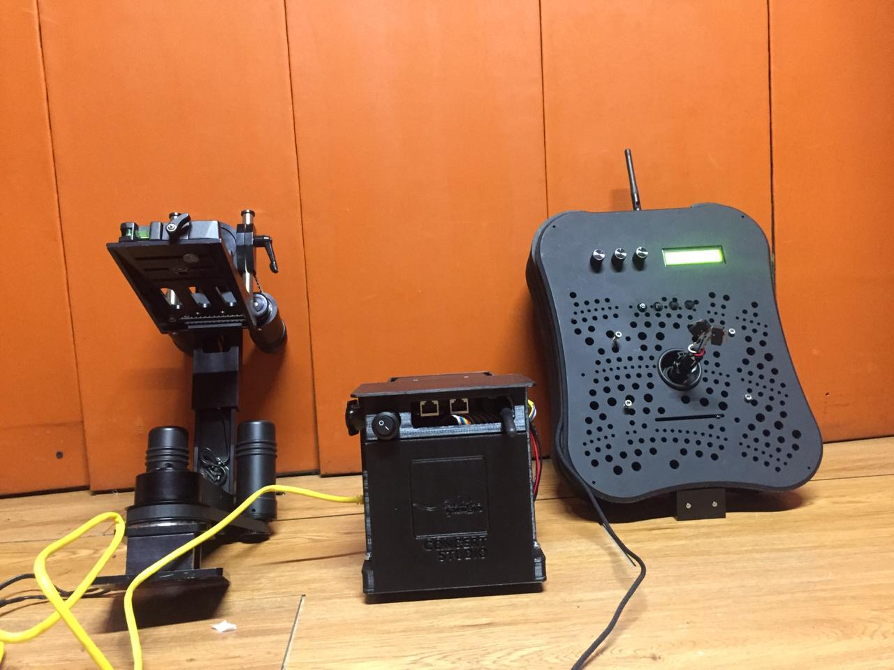
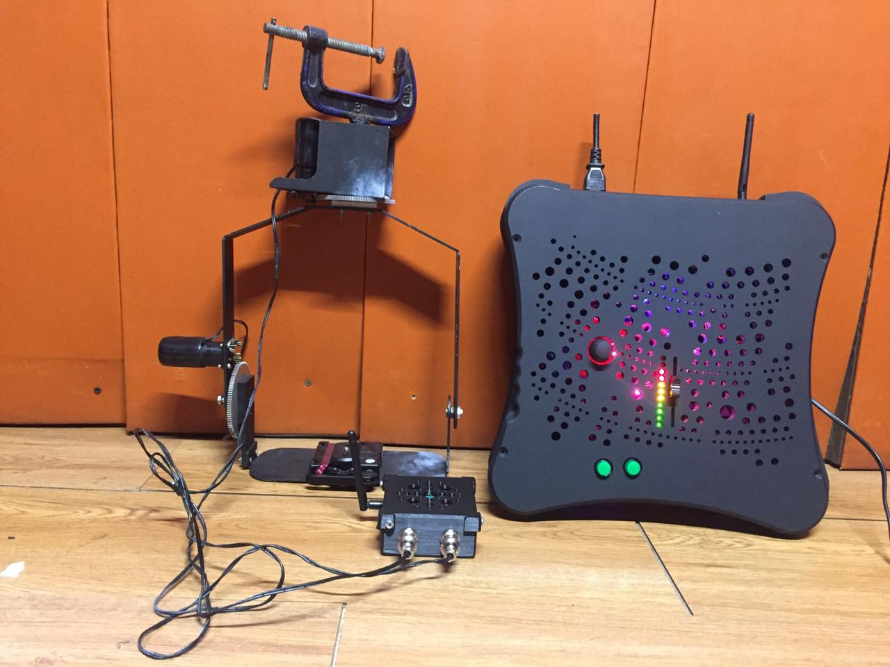

# IcanStudioLive-Project
All code that are associated with IcanStudio Live Project

the code for servo-pan-tilt uses 4 inputs, which produced 5 variables. Those inputs are from 2 buttons, 1 potentiometer, and 1 joystick (Which gives x and y variables). Those 5 variables are used to control the 3 motor of the pan-tilt camera. 

The code for servo-pan-tilt-with-NRF is the modification of the servo-pan-tilt code with the wireless connection of the NRF24L01 module. It receives the information from the wireless controller(transmitter) and assign it in an array of 4. Then it process those data to move the pan-tilt camera as in the servo-pan-tilt code

The code for Transmitter-with-control is the wireless controller(transmitter) code. It uses the same input as in the code for servo-pan-tilt and assign them in an array of 4 and send them via the NRF24L01 module to be received with the pan-tilt camera(receiver) 

NOTE: the code servo-pan-tilt-with-NRF does not work anymore for some reason. This is the first time i face, where at first it works like a charm, but when i try it next week, it does not work at all. The updated version of the code is the Testing_Receiver_Gede_Ver.2. and for the Transmitter-with-control, the updated version is Testing_Transmitter_Gede_Ver.2 . I developed those updated version in the NRF24L01 boat control project, then i implement it in this project. At last the code never fails. The struct method in the code also can be used for other communication like RX TX and HC12 RF module.

You can get the schematic and the PCB file for the first image in:
1. 40_pin_hbridge for the power distribution board
2. ICSL_Receiver_gede_Ver.2 for the receiver
3. IcanStudioLive_controller_kecil for the transmitter.

You can get the schematic and the PCB file for the second image in:
1. ICSL_Receiver_kecil for the receiver
2. IcanStudioLive_Controller_Mini_fix for the transmitter

